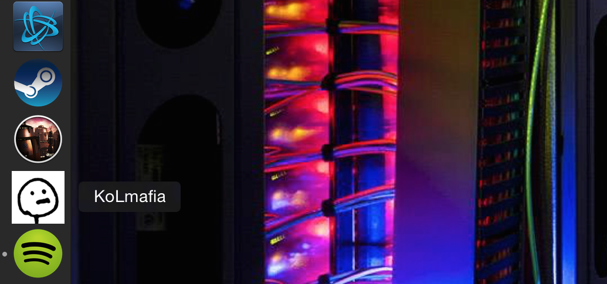

current-KoLMafia
================

A simple script to automatically download and launch the current build of KoL Mafia, an advanced interface for the online adventure game Kingdom of Loathing.

You can obtain the script by checking out the repository from the command line, like this:

`git clone git@github.com:mattleblanc/current-KoLMafia.git kolmafia/`

... or you can just grab it directly, like this:

`curl -O https://raw.githubusercontent.com/mattleblanc/current-KoLMafia/master/getLatestBuild.sh`

Running this script will download the latest hourly build of KoL Mafia to the folder you call the script from. It will then launch the .jar file using java ... if you can open the hourly builds when you manually download them, I am going to assume that you've got that figured out already.

=======

One thing I wanted to do was call this script directly from the OSX dock. This can be done using automator, following the description <a href="http://stackoverflow.com/questions/281372/executing-shell-scripts-from-the-os-x-dock">here</a>. Make a new workflow with one step, 'run shell script,' and point the workflow towards your copy of the script. I've just got something like this:

`cd /Users/<you>/kolmafia; source getLatestBuild.sh`

Save your workflow as an application and then stick it in the dock - you've now got a button to push which will  launch the latest hourly build! I've included the image that I use as the icon in the repository as well (it's the <a href="https://twitter.com/asym">@asym</a> twitter pic).

Enjoy!

-Zombie Feynman (#1886944)
